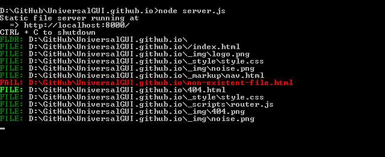

# NPM-Free-Server

This is a **very tiny** server. Without comments it's **50 lines of code** and it's **<1KB** (minified).

You do not need to use `npm install` to use this. You just need Node installed. Feel free to modify it for you project.

* * *

### How to run the server:

1. Install [Node.JS](http://nodejs.org)
2. `node server.js`

If you're on Windows you can just double-click the `server.bat`.

* * *

If you would like for the server to auto launch a browser at the correct localhost address, you use the npm module open, by either requiring it in, or simply copying it's JS file from it's repo into this JS file.

* https://www.npmjs.com/package/open
